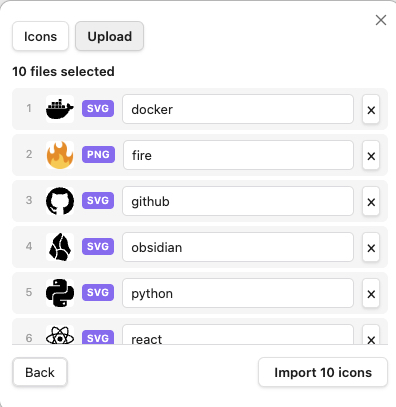

# Obsidian Custom Icon

<p align="center">
  <a href="https://github.com/t1seo/obsidian-custom-icon/releases"></a>
  <a href="https://github.com/t1seo/obsidian-custom-icon/releases/latest"></a>
  <a href="https://github.com/t1seo/obsidian-custom-icon/releases/latest"></a>
  <a href="./README.md"></a>
</p>

[Obsidian](https://obsidian.md)의 파일과 폴더에 **나만의 커스텀 아이콘**을 추가하세요. PNG, JPG, SVG 이미지를 업로드하면 탐색기, 탭 헤더, 노트 제목, 인라인 텍스트에서 사용할 수 있습니다.

<p align="center">
  
</p>

## 주요 기능

### 탐색기 커스텀 아이콘

업로드한 아이콘을 파일과 폴더에 적용할 수 있습니다. 라이트/다크 테마 모두 지원합니다.

<p align="center">
  
  
</p>

### 아이콘 피커

아이콘 라이브러리를 탐색하고 관리하세요. 드래그 앤 드롭, 파일 선택, 클립보드 붙여넣기로 새 아이콘을 업로드할 수 있습니다.

<p align="center">
  
  
</p>

### 배치 가져오기 & SVG 지원

여러 파일을 한 번에 선택하여 일괄 가져오기할 수 있습니다. SVG 파일은 벡터 품질과 투명도를 유지한 채 원본 그대로 저장됩니다. 가져오기 전에 이름을 수정하거나 불필요한 파일을 제거할 수 있습니다.

<p align="center">
  
</p>

### 컨텍스트 메뉴

파일이나 폴더를 우클릭하면 커스텀 아이콘을 변경하거나 제거할 수 있습니다.

<p align="center">
  
</p>

### 인라인 아이콘

`:custom-icon-이름:` 단축코드를 사용해 노트 본문에 아이콘을 삽입할 수 있습니다.

<p align="center">
  
</p>

## 설치 방법

### Obsidian 커뮤니티 플러그인 (준비 중)

1. **설정** > **커뮤니티 플러그인** > **탐색**
2. **"Custom Icon"** 검색
3. **설치** 후 **활성화**

### 수동 설치

1. [Releases](https://github.com/t1seo/obsidian-custom-icon/releases)에서 최신 릴리스 다운로드
2. `main.js`, `manifest.json`, `styles.css`를 다음 경로에 압축 해제:
   ```
   <볼트>/.obsidian/plugins/custom-icon/
   ```
3. **설정** > **커뮤니티 플러그인**에서 플러그인 활성화

## 사용 방법

1. **아이콘 업로드** — 아이콘 피커를 열고 **Upload** 탭으로 이동합니다. 드래그 앤 드롭 또는 클릭으로 PNG, JPG, SVG 파일을 업로드하세요.
2. **배치 가져오기** — 여러 파일을 한 번에 선택하면 일괄 가져오기됩니다. 가져오기 전에 이름을 수정하거나 불필요한 파일을 제거할 수 있습니다.
3. **아이콘 적용** — 탐색기에서 파일이나 폴더를 우클릭하고 **Change custom icon**을 선택한 뒤 라이브러리에서 아이콘을 선택하세요.
4. **인라인 아이콘** — 설정에서 인라인 아이콘을 활성화한 뒤, 노트에 `:custom-icon-이름:`을 입력하세요 (`이름`은 라이브러리에 등록된 아이콘 이름).

## 지원

문제가 발생하거나 기능 요청이 있으면 [이슈를 등록](https://github.com/t1seo/obsidian-custom-icon/issues)해주세요.

이 플러그인이 유용하다면 커피 한 잔 사주세요!

[](https://www.buymeacoffee.com/taewonseo)

## 라이선스

[MIT](LICENSE)
