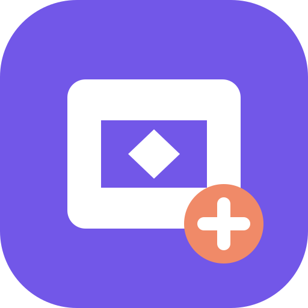
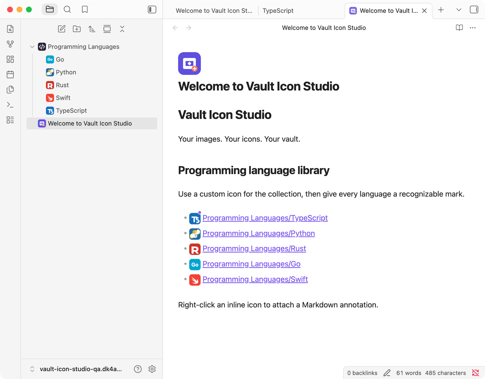
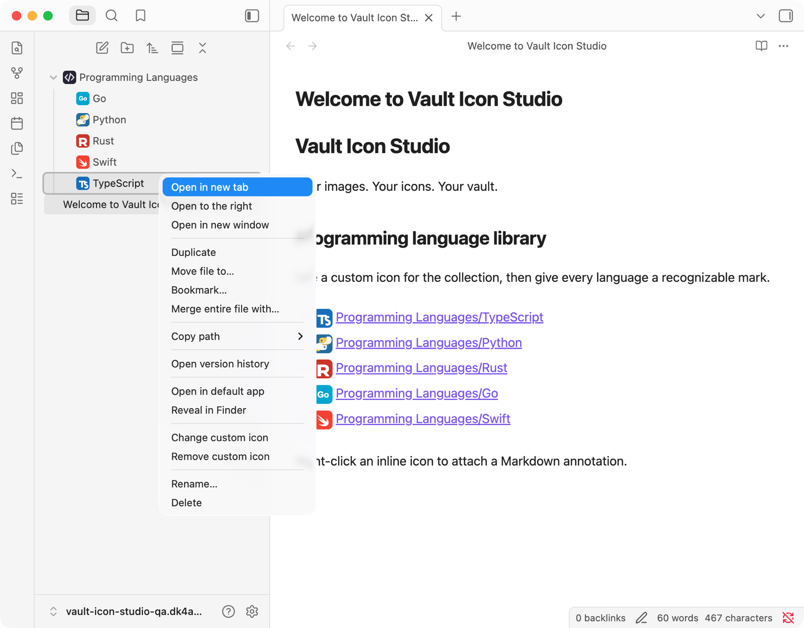
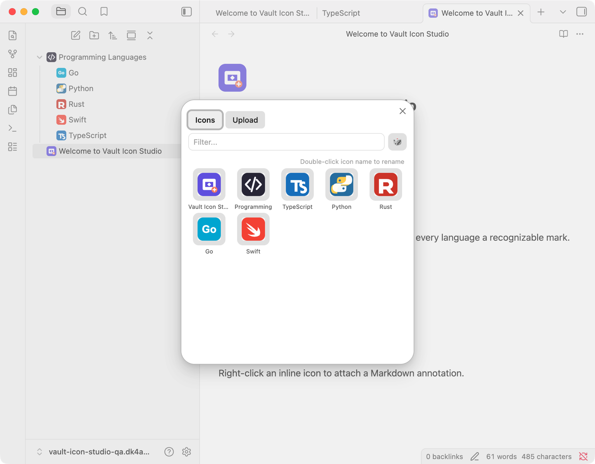
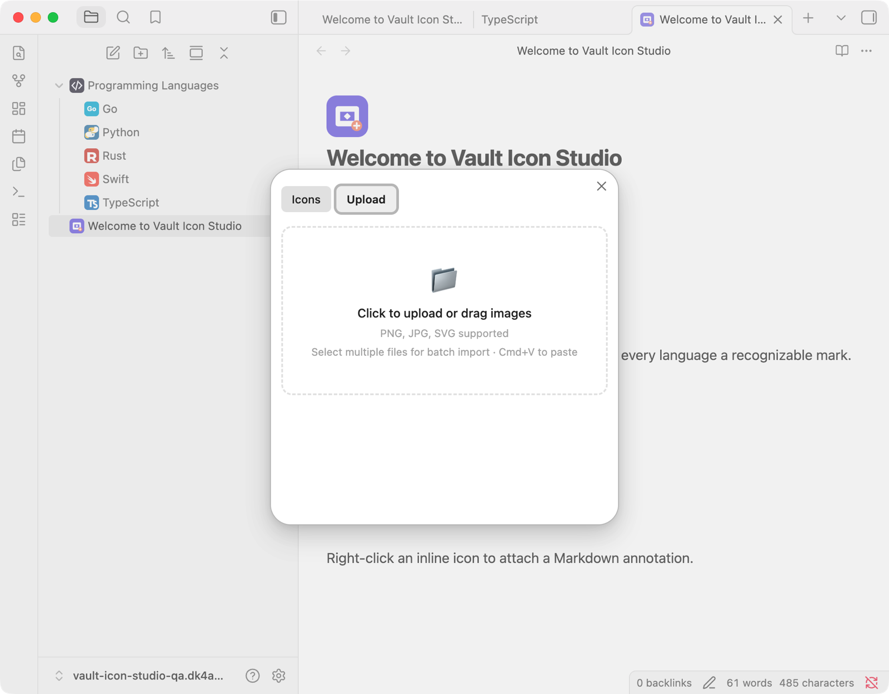
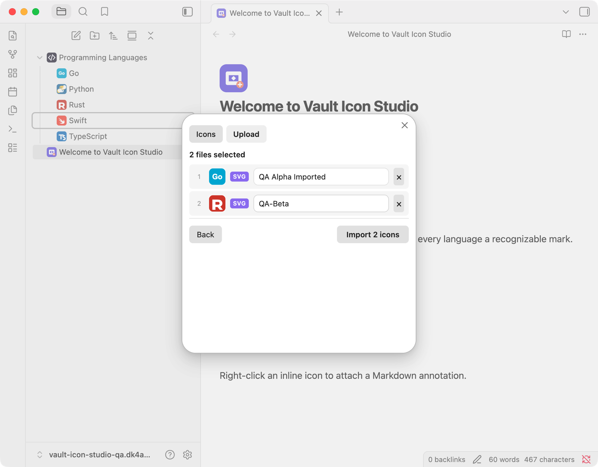
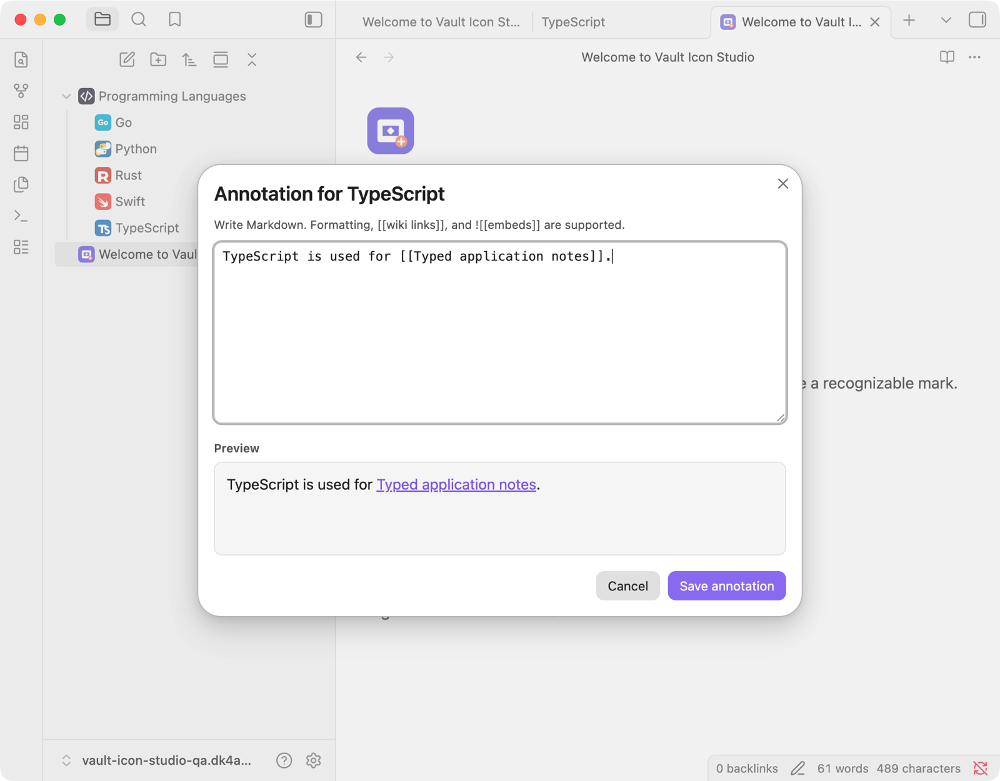
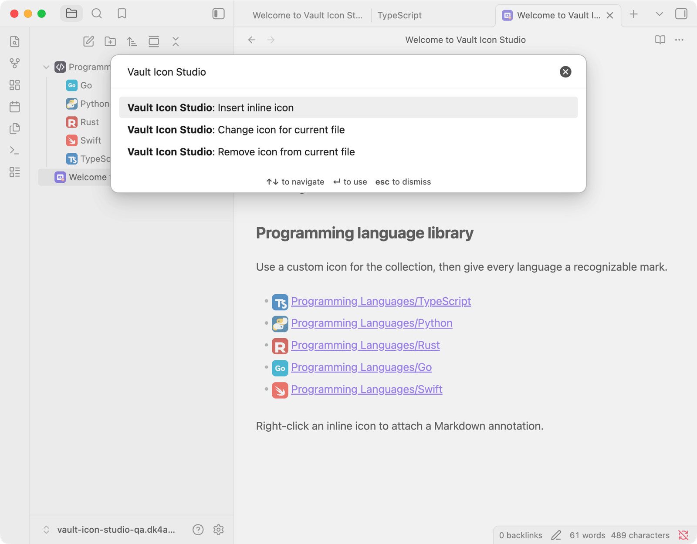
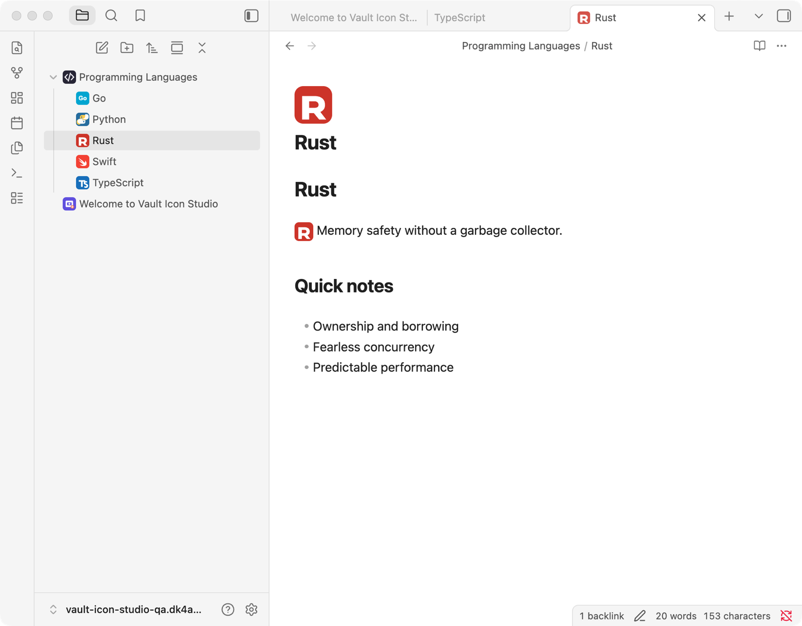

# Vault Icon Studio

<p align="center">
  
</p>

<p align="center"><strong>내 이미지로, 내 아이콘으로, 내 볼트를.</strong></p>

<p align="center">
  <a href="https://github.com/t1seo/vault-icon-studio/actions/workflows/ci.yml"></a>
  <a href="https://github.com/t1seo/vault-icon-studio/releases/latest"></a>
  <a href="LICENSE"></a>
  <a href="README.md"></a>
</p>

PNG, JPG, WebP, SVG 이미지를 업로드해 Obsidian의 폴더, 노트, 탭, 노트 제목, 본문 아이콘으로 사용하세요. 모든 데이터는 볼트 안에 저장됩니다.



## 2분 만에 시작하기

1. 파일이나 폴더를 우클릭하고 **Change custom icon**을 선택합니다.
2. 라이브러리 아이콘을 고르거나 **Upload** 탭에서 이미지를 추가합니다.
3. 지정한 아이콘은 탐색기, 탭, 노트 제목에 함께 표시됩니다.
4. 인라인 아이콘을 활성화하고 노트에 `:ci-typescript:` 같은 shortcode를 입력합니다.

| 할 수 있는 일 | 표시되는 곳 |
| --- | --- |
| 폴더에 아이콘 지정 | 파일 탐색기 |
| 노트에 아이콘 지정 | 파일 탐색기, 탭, 노트 제목 |
| `:ci-이름:` 삽입 | 라이브 프리뷰, 읽기 모드 |
| 인라인 아이콘에 주석 추가 | 강조 점, Markdown 호버 카드 |

<p align="center">
  
  
</p>

## 실제 예시: 프로그래밍 언어 라이브러리

저장소에 포함된 [샘플 볼트](examples/programming-languages-vault)는 컬렉션 폴더와 각 언어를 한눈에 구분할 수 있게 구성했습니다.

```text
Programming Languages/       </> 폴더 아이콘
├── TypeScript.md             TS 아이콘
├── Python.md                 Python 아이콘
├── Rust.md                   R 아이콘
├── Go.md                     Go 아이콘
└── Swift.md                  Swift 아이콘
```

각 언어 노트 안에서도 같은 아이콘을 사용합니다.

```md
# TypeScript

:ci-typescript: 대규모 애플리케이션을 위한 타입 안전 JavaScript.
```

파일명이나 frontmatter를 바꾸지 않아도 큰 볼트의 구조를 훨씬 빠르게 파악할 수 있습니다.

## 아이콘 업로드와 관리

파일 메뉴 또는 명령 팔레트에서 아이콘 피커를 열고 **Upload**를 선택하세요. 파일 선택, 드래그 앤 드롭, 클립보드 붙여넣기를 지원합니다.



여러 파일을 선택하면 가져오기 전에 이름을 검토하고 수정할 수 있습니다. SVG는 래스터 이미지로 변환하지 않고 벡터 파일 그대로 보관합니다.



**Icons** 탭에서 이름을 더블클릭하면 아이콘 이름을 바꿀 수 있습니다. 제거 버튼으로 라이브러리에서 삭제하면 해당 아이콘을 사용하던 지정도 함께 정리됩니다.

## 인라인 아이콘과 Markdown 주석

플러그인 설정에서 인라인 아이콘을 활성화한 후 `:ci-`를 입력하면 자동완성이 열립니다. 명령 팔레트에서도 삽입할 수 있습니다. 기본 형식은 다음과 같습니다.

```text
:ci-아이콘-ID:
```

렌더링된 인라인 아이콘을 우클릭하고 **Add icon annotation**을 선택하세요. Markdown, `[[위키 링크]]`, `![[임베드]]`를 지원하며 실시간 미리보기를 제공합니다. 주석이 있는 아이콘에는 작은 강조 점이 표시됩니다.



주석은 아이콘이 등장한 위치별로 저장됩니다. `:ci-typescript~note-a1b2c3d4:`처럼 인스턴스 접미사가 자동으로 붙기 때문에 같은 아이콘을 여러 번 사용해도 서로 다른 메모를 남길 수 있습니다.

## 명령 팔레트

`Cmd/Ctrl+P`를 누르고 **Vault Icon Studio**를 검색하면 세 명령을 사용할 수 있습니다.

- **Insert inline icon**
- **Change icon for current file**
- **Remove icon from current file**



## 설정



| 설정 | 용도 | 기본값 |
| --- | --- | --- |
| Enable inline icons | `:ci-이름:` shortcode 렌더링 | 꺼짐 |
| Inline icon size | 인라인 아이콘 크기 12~64 px | 20 px |
| Inline icon prefix | `ci`를 원하는 접두사로 변경 | `ci` |

## 설치

### Obsidian 커뮤니티 플러그인

현재 커뮤니티 디렉터리 등록을 진행하고 있습니다. 승인 후에는 다음처럼 설치할 수 있습니다.

1. **설정 → 커뮤니티 플러그인 → 탐색**을 엽니다.
2. **Vault Icon Studio**를 검색합니다.
3. **설치** 후 **활성화**합니다.

### BRAT

1. [BRAT](https://obsidian.md/plugins?id=obsidian42-brat)을 설치하고 활성화합니다.
2. **BRAT: Add a beta plugin for testing**을 실행합니다.
3. `https://github.com/t1seo/vault-icon-studio`를 입력합니다.
4. **설정 → 커뮤니티 플러그인**에서 **Vault Icon Studio**를 활성화합니다.

### 수동 설치

1. [최신 릴리스](https://github.com/t1seo/vault-icon-studio/releases/latest)에서 `main.js`, `manifest.json`, `styles.css`를 받습니다.
2. 세 파일을 `<볼트>/.obsidian/plugins/custom-icon/`에 넣습니다.
3. Obsidian을 다시 불러온 뒤 **Vault Icon Studio**를 활성화합니다.

폴더와 플러그인 ID는 호환성을 위해 `custom-icon`으로 유지합니다. 기존 설정, 아이콘 라이브러리, BRAT 설치, 단축키, `:ci-...:` 노트 내용은 제품 이름이 바뀐 뒤에도 그대로 동작합니다.

## 샘플 볼트

저장소의 [examples/programming-languages-vault](examples/programming-languages-vault)는 README 스크린샷에 사용한 것과 같은 구조입니다. 릴리스의 세 파일을 샘플의 `.obsidian/plugins/custom-icon/`에 복사한 뒤 해당 폴더를 Obsidian 볼트로 열면 됩니다. 자세한 내용은 [샘플 가이드](docs/SAMPLE-VAULT.md)를 참고하세요.

## 개인정보와 저장 위치

Vault Icon Studio는 네트워크 요청을 하지 않으며 런타임 의존성이 없습니다. 아이콘, 지정 정보, 설정, 주석은 모두 볼트의 `.obsidian/plugins/custom-icon/` 아래에 로컬로 저장됩니다.

## 개발 및 릴리스

```sh
npm ci
npm run verify
```

[QA 근거](docs/QA.md), [릴리스 안내](docs/RELEASING.md), [GitHub 피드백 및 배포 문제 분석](docs/research/github-feedback.md), [커뮤니티 디렉터리 리서치](docs/research/obsidian-community-release.md)를 참고하세요.

## 지원

버그나 기능 요청은 [GitHub 이슈](https://github.com/t1seo/vault-icon-studio/issues)에 남겨주세요.

[](https://www.buymeacoffee.com/taewonseo)

## 라이선스

[MIT](LICENSE)
