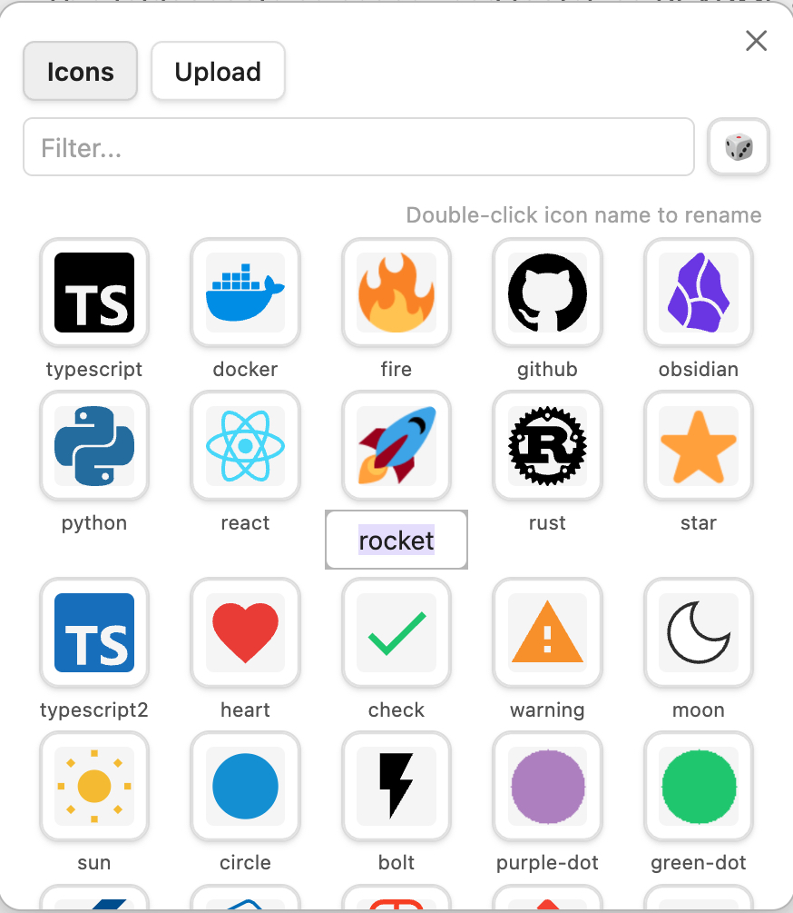
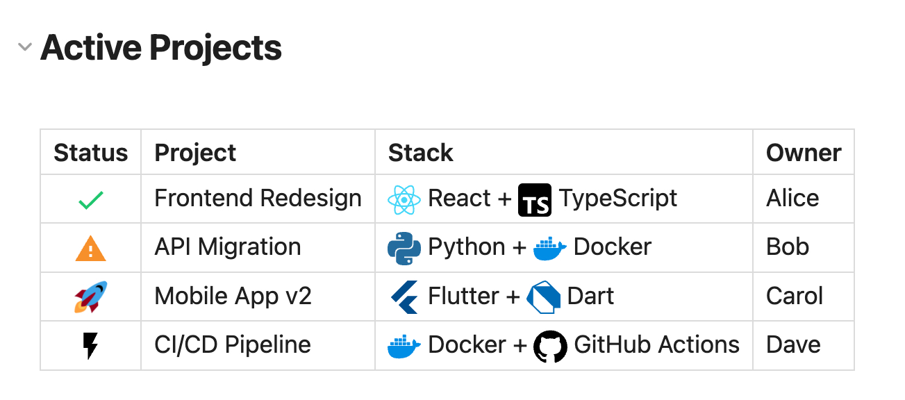
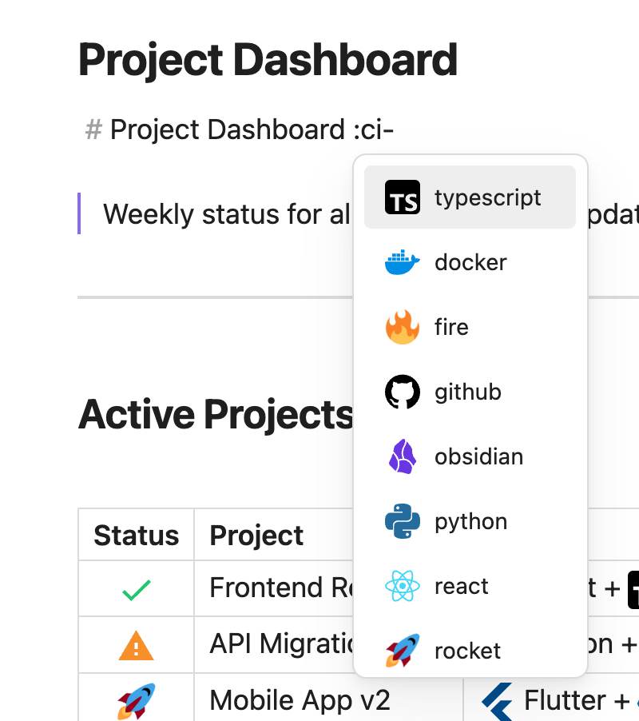
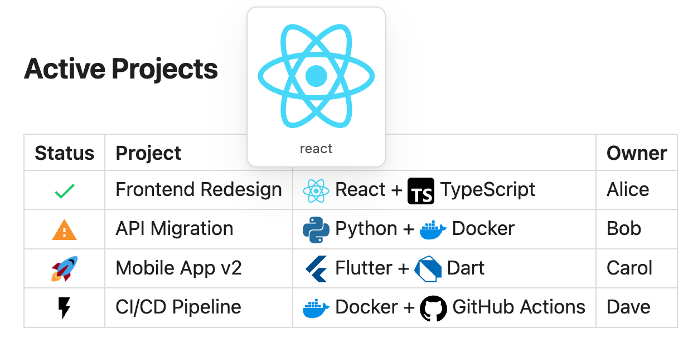
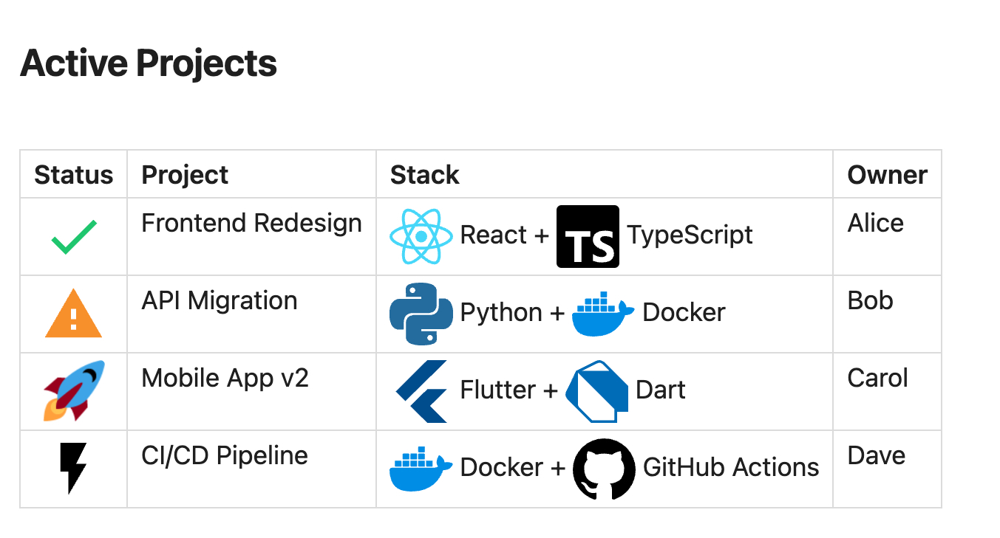
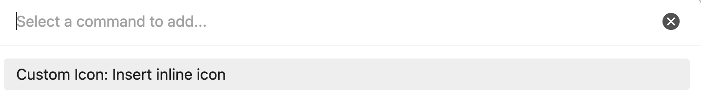
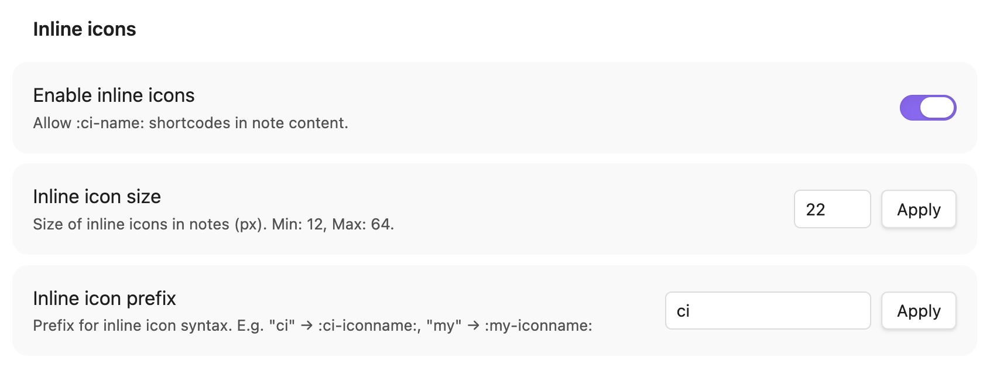

# Obsidian Custom Icon

<p align="center">
  <a href="https://github.com/t1seo/obsidian-custom-icon/releases"></a>
  <a href="https://github.com/t1seo/obsidian-custom-icon/releases/latest"></a>
  <a href="https://github.com/t1seo/obsidian-custom-icon/releases/latest"></a>
  <a href="./README.ko.md"></a>
</p>

Add **custom image icons** to files and folders in [Obsidian](https://obsidian.md). Upload your own PNG, JPG, or SVG images and use them across the file explorer, tab headers, note titles, and inline text.

<p align="center">
  
</p>

## Features

### Explorer Icons

Assign uploaded icons to any file or folder. Icons appear in the file explorer, tab headers, and as a large Notion-style icon above the note title. Works seamlessly in both light and dark themes with full transparency support.

<p align="center">
  
  
</p>

### Icon Picker & Rename

Browse and manage your icon library. Upload new icons via drag & drop, file picker, or clipboard paste. **Double-click** an icon's name to rename it instantly.

<p align="center">
  
  
</p>

<p align="center">
  
</p>

### Batch Import & SVG Support

Select multiple files at once to batch import. SVG files are stored natively (no rasterization), preserving vector quality and transparency. Review and rename icons before importing.

<p align="center">
  
</p>

### Inline Icons

Use `:ci-NAME:` shortcodes to embed icons directly in your notes. Works in both editing and reading mode.

- **Autocomplete** — Type `:ci-` and get IDE-style suggestions with icon previews
- **Hover preview** — Mouse over any inline icon to see a large preview with its name
- **Configurable size** — Adjust icon size (12-64px) with instant preview
- **Custom prefix** — Change the shortcode prefix to anything you like (e.g. `:my-NAME:`)
- **Command palette** — Insert icons via `Cmd/Ctrl+P` → "Insert inline icon"

<p align="center">
  
</p>

<p align="center">
  
  
</p>

<p align="center">
  
</p>

### Context Menu & Commands

Right-click any file or folder to change or remove its custom icon. Three commands are available in the command palette:

- **Change icon for current file** — Open the icon picker for the active note
- **Remove icon from current file** — Remove the assigned icon
- **Insert inline icon at cursor** — Pick and insert an inline icon shortcode

<p align="center">
  
  
</p>

### Settings

<p align="center">
  
</p>

| Setting | Description | Default |
|---------|-------------|---------|
| Enable inline icons | Toggle `:ci-NAME:` shortcodes in notes | Off |
| Inline icon size | Icon size in pixels (12-64) | 20px |
| Inline icon prefix | Shortcode prefix (e.g. `ci`, `my`, `icon`) | `ci` |

## Installation

### From Obsidian Community Plugins (coming soon)

1. Open **Settings** > **Community plugins** > **Browse**
2. Search for **"Custom Icon"**
3. Click **Install**, then **Enable**

### Manual Installation

1. Download the latest release from [Releases](https://github.com/t1seo/obsidian-custom-icon/releases)
2. Extract `main.js`, `manifest.json`, and `styles.css` into:
   ```
   <vault>/.obsidian/plugins/custom-icon/
   ```
3. Enable the plugin in **Settings** > **Community plugins**

## Usage

1. **Upload icons** — Open the icon picker and go to the **Upload** tab. Drag & drop, click to browse, or paste from clipboard.
2. **Batch import** — Select multiple files to import them all at once. Review names before importing.
3. **Assign icons** — Right-click a file or folder in the explorer and select **Change custom icon**.
4. **Rename icons** — In the icon picker, double-click an icon's name to rename it.
5. **Inline icons** — Enable in settings, then type `:ci-NAME:` in your notes (where `NAME` is the icon name or ID).
6. **Autocomplete** — Type `:ci-` in the editor and select from the suggestion popup. Filter by typing more characters.
7. **Insert via command** — Press `Cmd/Ctrl+P`, search "Insert inline icon", and pick from your library.

## Support

If you encounter any issues or have feature requests, please [open an issue](https://github.com/t1seo/obsidian-custom-icon/issues).

If you find this plugin useful, consider buying me a coffee!

[](https://www.buymeacoffee.com/taewonseo)

## License

[MIT](LICENSE)
