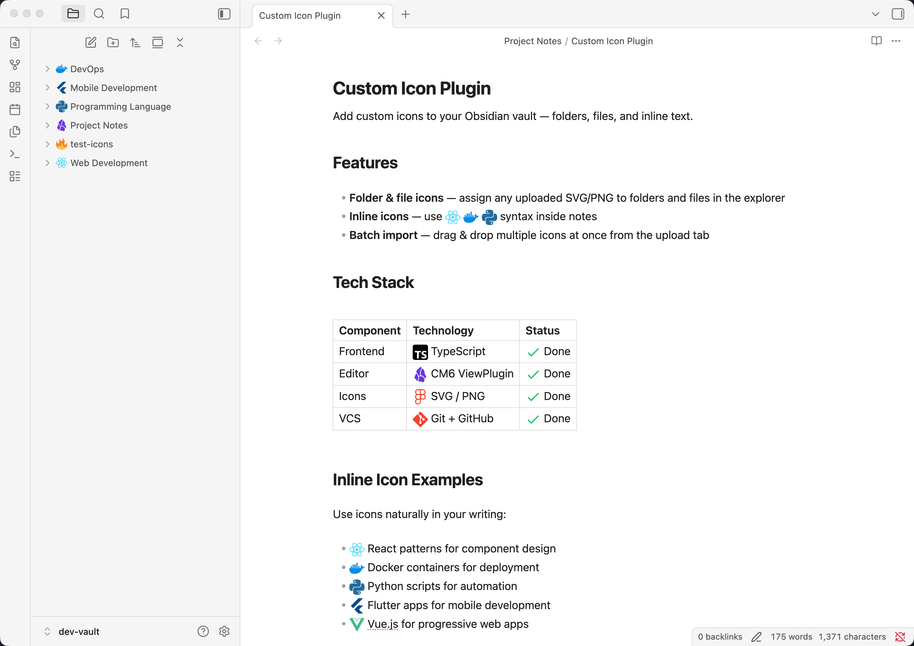
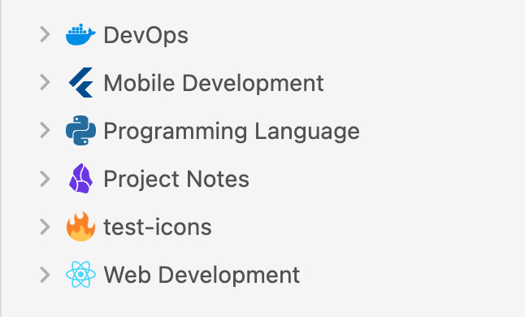
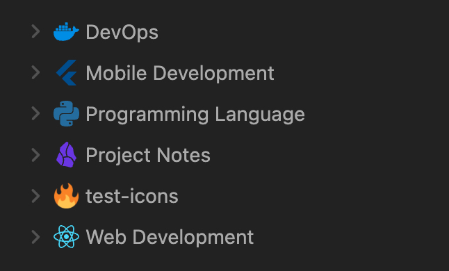
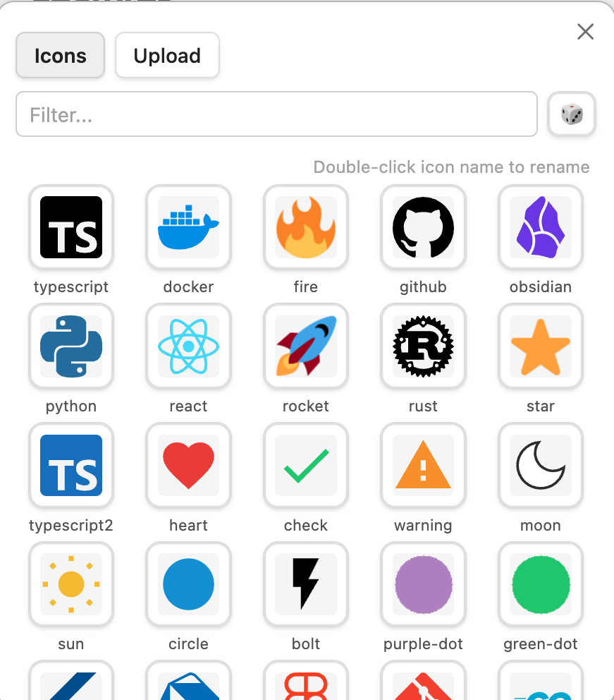
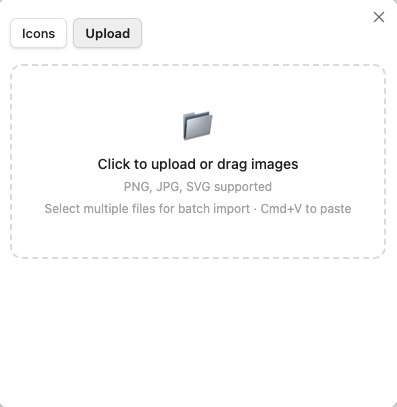
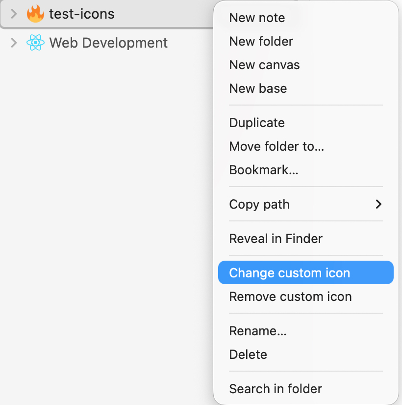
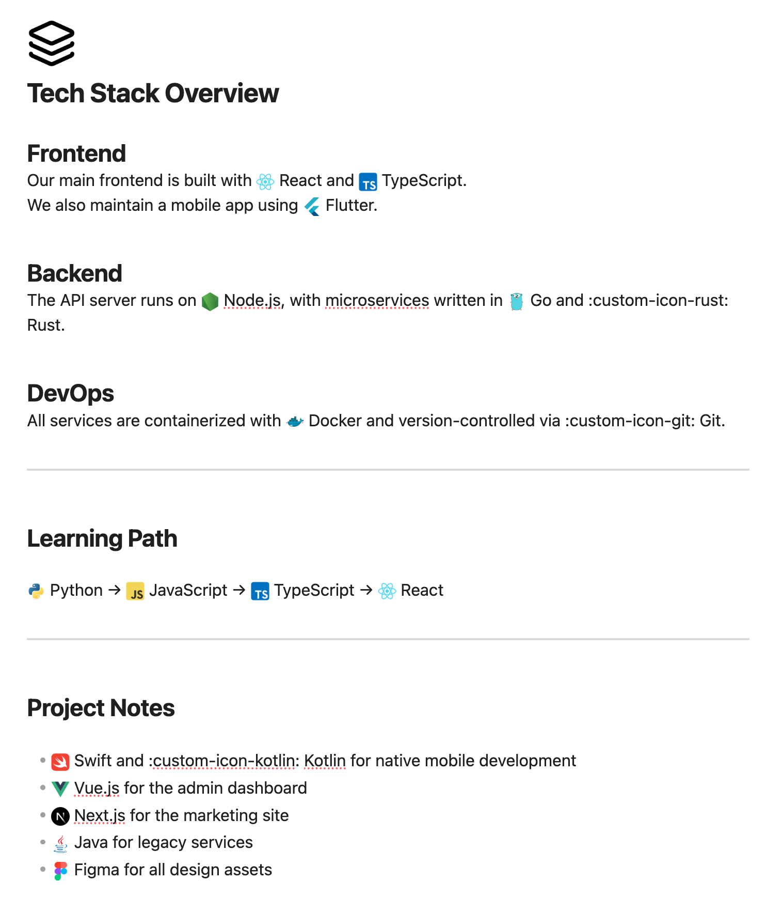

# Obsidian Custom Icon

<p align="center">
  <a href="https://github.com/t1seo/obsidian-custom-icon/releases"></a>
  <a href="https://github.com/t1seo/obsidian-custom-icon/releases/latest"></a>
  <a href="https://github.com/t1seo/obsidian-custom-icon/releases/latest"></a>
  <a href="./README.ko.md"></a>
</p>

Add **custom image icons** to files and folders in [Obsidian](https://obsidian.md). Upload your own PNG, JPG, or SVG images and use them across the explorer, tab headers, note titles, and inline text.

<p align="center">
  
</p>

## Features

### Custom Icons in Explorer

Assign uploaded icons to any file or folder. Works seamlessly in both light and dark themes.

<p align="center">
  
  
</p>

### Icon Picker

Browse and manage your icon library. Upload new icons via drag & drop, file picker, or clipboard paste.

<p align="center">
  
  
</p>

### Context Menu

Right-click any file or folder to change or remove its custom icon.

<p align="center">
  
</p>

### Inline Icons

Use `:custom-icon-NAME:` shortcodes to embed icons directly in your notes.

<p align="center">
  
</p>

## Installation

### From Obsidian Community Plugins (coming soon)

1. Open **Settings** > **Community plugins** > **Browse**
2. Search for **"Custom Icon"**
3. Click **Install**, then **Enable**

### Manual Installation

1. Download the latest release from [Releases](https://github.com/t1seo/obsidian-custom-icon/releases)
2. Extract `main.js`, `manifest.json`, and `styles.css` into:
   ```
   <vault>/.obsidian/plugins/obsidian-custom-icon/
   ```
3. Enable the plugin in **Settings** > **Community plugins**

## Usage

1. **Upload icons** — Open the icon picker and go to the **Upload** tab. Drag & drop or click to upload PNG, JPG, or SVG files.
2. **Assign icons** — Right-click a file or folder in the explorer and select **Change custom icon**, then pick from your library.
3. **Inline icons** — Enable inline icons in settings, then type `:custom-icon-NAME:` in your notes (where `NAME` is the icon name in your library).

## Support

If you encounter any issues or have feature requests, please [open an issue](https://github.com/t1seo/obsidian-custom-icon/issues).

If you find this plugin useful, consider buying me a coffee!

<a href="https://buymeacoffee.com/taewonseo"></a>

## License

[MIT](LICENSE)
